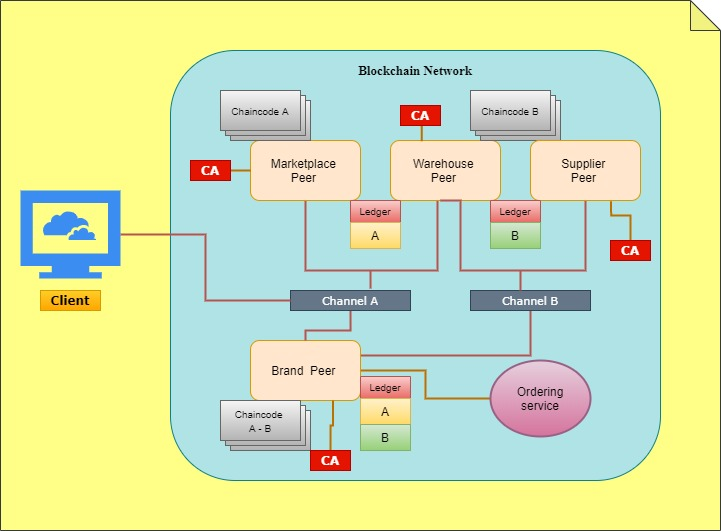

# KYP Know your Product Dapp 2 project

- My Resume: https://drive.google.com/open?id=1LdwmQcR2AlmQS-m9fPUPipemxaTGRAVN
- App pitch presentation: https://drive.google.com/open?id=13gEys9WEKY5SOIddf0M-v430OmNsZQPm
- App blockchain diagram: https://drive.google.com/open?id=1KX-onsrtsr8l6VQZJZ5v57wZ4wlB-GHG
- App front-end demo: https://andresponton21.github.io/dapp2_project/
- App chaincode repo: https://github.com/andresponton21/chaincode_dapp2.git

## Introduction

This dapp approaches the great problem that online market places face when counterfeit products are infiltrated into their market network. 

## Solution

Create a Decentralized application on a blockchain platform, in this case Hyper ledger Fabric, this app uses a smart contract to verify the authenticity of a product :

- It creates a unique id or hash, for every product that is out the production line
- The product’s Id, will be permanently recorded on the blockchain, so no one can alter this data.
- Using hyper ledger fabric, only permissioned parties can see the data on the ledger, in this case the consumer, the seller and the supplier.
- The customer can easily verify the product’s authenticity, using a hash value or scanning a QR code.

Blockchain network diagram:

  

 
## Architecture

<!--  -->

_Architecture of the D'app._

Components:

- User Interface: web application using Reactjs.
- Back end: server providing API using Nodejs (to be developed).
- Database: on-chain (Hyperledger Fabric) and off-chain (cloud database, to be developed).

## Data Management

### On-chain data HLF

| Variable Name | Type     | Key         | Value                                         | Notes              |
| ------------- | -------- | ----------- | --------------------------------------------- | ------------------ |
| productIfoId  | `Object` | `productID` | {`access_list`,`allowed_list`,`product_info`} | hash value product |
| mktPlaceInfo  | `Object` | `mkplacID`  | {`allowed_list`}                              | info for sellers   |

- Details for the value of variable.
  | Name | Type | Details | Notes |
  |------|------|---------|--------------------------------------------------------------------|
  | access_list | `Array` | [{ `role`, `userID`},...] | list of ids can access product |
  | allowed_list | `Array` | [{`role`, `userID` },...] | list of ids that can access products |
  | product_info   | `Array` | [{`date`,`writer_id`,`information` },...] | list of products |

### Off-chain data

- Email and password is used to authorize user. Cloud database handles sign in and sign up.
- User information including full name and role is stored in cloud database to be determined.
- Brand names, marketplaces are stored in a cloud database

## The Flow of Application

1. A user has to sing up entering name, email and type of user
2. In the first time, they are asked to choose user and write their name (a specific record is made in couchDB).
3. The marketplace releases a product to the allowed list, it means that is sold to a customer
4. The customer sings up
5. The customer enters the hash value that represents the product's id.
6. The product's id gets recorded in the blockchain and is now verified
7. If the customer tries to record the same hash again, it would get a message


### Setup

```
npm install
or
yarn install
```

### Compiles and live-reloads for development

```
npm start
or
yarn start
```

## Project by:

- Andres Ponton - 101216141

